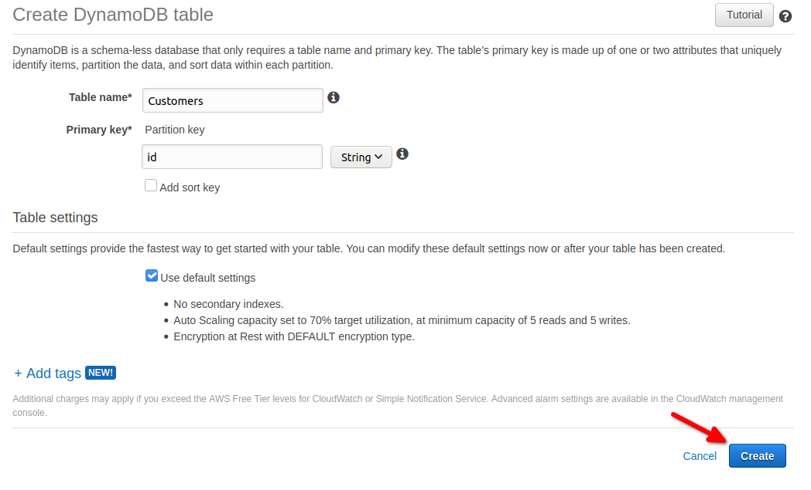

# Implementing a GraphQL API using AWS AppSync

[GraphQL][1] is an exciting API specification that has been around
since 2005 and offers a graph based way to build APIs.

Typically a graph defines a group
of nodes that are related to each other and have certain attributes:


The graph based approach allows API consumers to navigate through the different nodes and
gather only the information they need, as opposed to REST APIs where response bodies are already defined. This implies that GraphQL is helpful when data can be easily represented
in a graph, otherwise it might not be the right solution.

# Use case

The aim of this blog post is to demonstrate how to get started with GraphQL using
[AWS AppSync][2]. Quoting [AWS documentation][2]:

> AWS AppSync is a fully managed service that makes it easy to develop GraphQL APIs by
> handling the heavy lifting of securely connecting to data sources like AWS DynamoDB,
> Lambda, and more.

To show you how it works we will implement a small API that creates and
queries customer objects stored in a [DynamoDB table][3].

In our use case, customers have a first name, last name and an age. We want
to be able to create them with an automatically generated ID as well as query the
whole collection of customers and individual customers.

# Implementation

First of all we need to create an AppSync App:


## Schema

Now we're ready to start defining the API's schema:


Let's start by creating a Customer:

```
type Customer {
    id: ID!
    firstName: String!
    lastName: String!
    age: Int
}
```

As you can see, `id`, `firstName` and `lastName` have an exclamation mark (!) following
their scalar types - that denotes that they are required fields whereas `age` is not.

Then, we need to specify our queries:

```
type Query {
    getCustomers: [Customer]
    getCustomer(id: ID!): Customer
}
```

This means that `getCustomers` returns a collection of customers and `getCustomer`
returns the customer matching the given id.

Creating a customer is done by using a so called _Mutation_:

```
type Mutation {
    createCustomer(firstName: String!, lastName: String!, age: Int): Customer
}
```

Using the `createCustomer` Mutation with the mandatory parameters `firstName` and
`lastName` and the optional parameter `age` we can create a new customer.

Finally, both queries and mutations need to be specified in the schema:

```
schema {
    query: Query
    mutation: Mutation
}
```

The complete schema should look like this:


## Data source

GraphQL itself does not provide any storage functionality. Data may come from different
sources including databases such as DynamoDB, RDS or ElasticSearch as well
as Lambda or HTTP endpoints. We're going to use DynamoDB because it's a flexible easy to
use database solution.

First we navigate to the AWS DynamoDB service and create the `Customers` table:



Then we switch back to our AWS AppSync API to add the corresponding data source:


## Resolvers

In order to tell AppSync how to interact with our DynamoDB table we need to define resolvers for
each query or mutation in our schema.

Creating a resolver can be done by clicking on
_Attach_ next to the method name.


Afterwards we need to select `Customers`
as data source and configure the mapping templates as follows:

### createCustomer

**Request mapping template:**

```
{
    "version" : "2017-02-28",
    "operation" : "PutItem",
    "key" : {
        "id": $util.dynamodb.toDynamoDBJson($util.autoId())
    },
    "attributeValues" : $util.dynamodb.toMapValuesJson($ctx.args)
}
```

**Response mapping template:**

```
$util.toJson($ctx.result)
```

This way a new customer will be created using the given parameters and automatically
generated Id. As a response we'll receive the created customer.

### getCustomers

Getting all customers can be done by scanning the DynamoDB table:

**Request mapping template:**

```
{
    "version" : "2017-02-28",
    "operation" : "Scan"
}
```

**Response mapping template:**

```
$util.toJson($ctx.result.items)
```

which will return the whole collection of customers.

### getCustomer

Finally, this is how to retrieve a single customer:

**Request mapping template:**

```
{
    "version": "2017-02-28",
    "operation": "GetItem",
    "key": {
        "id": $util.dynamodb.toDynamoDBJson($ctx.args.id)
    }
}
```

**Response mapping template:**

```
$util.toJson($ctx.result)
```

## Testing the API

The API can be tested using the built-in Queries tool:


In this example we created a new customer called "Jane Doe" and afterwards we queried
all customers.

### Authorization

As the previous screenshot shows, we're using an API key that is created by AppSync
by default to authorize our requests. However, it is possible to choose among multiple authorization
options including IAM and OpenID Connect.

### cURL examples

Using the desired authorization method you can now invoke your API from wherever you want,
e.g. with cURL.

**Creating a customer**

```
curl -X POST \
  -H 'Content-Type: application/json' \
  -H 'x-api-key: <api_key>' \
  -d '{"query":"mutation {createCustomer(firstName: \"Jane\", lastName: \"Doe\") {id}}"}' \
  https://<graphql_api_id>.appsync-api.eu-central-1.amazonaws.com/graphql
```


**Retrieving all customers**

```
curl -X POST \
  -H 'Content-Type: application/json' \
  -H 'x-api-key: <api_key>' \
  -d '{"query":"{getCustomers {id, firstName, lastName, age}}"}' \
  https://<graphql_api_id>.appsync-api.eu-central-1.amazonaws.com/graphql
```

**Retrieve a customer**

```
curl -X POST \
  -H 'Content-Type: application/json' \
  -H 'x-api-key: <api_key>' \
  -d '{"query":"{getCustomer(id: \"<customer_id>\") {id, firstName, lastName, age}}"}' \
  https://<graphql_api_id>.appsync-api.eu-central-1.amazonaws.com/graphql
```

## Conclusion

GraphQL excels when the data you want to expose can be well described as a graph and
offers advantages over REST APIs such as more flexibility for consumers to retrieve
exactly the information they need.

It's a promising fast growing technology which is already widely used by big
tech players such as GitHub, Twitter or Facebook.

As we have seen in this article, there's already good tooling available in the market
to deliver and consume GraphQL APIs.

If you want to see a more detailed terraform automated way to implement what is
described here you are welcome to check out this GitHub repository: [aws-graphql-demo][4].


[1]: https://graphql.org/
[2]: https://aws.amazon.com/appsync/
[3]: https://aws.amazon.com/dynamodb/
[4]: https://github.com/xalvarez/aws-graphql-demo
